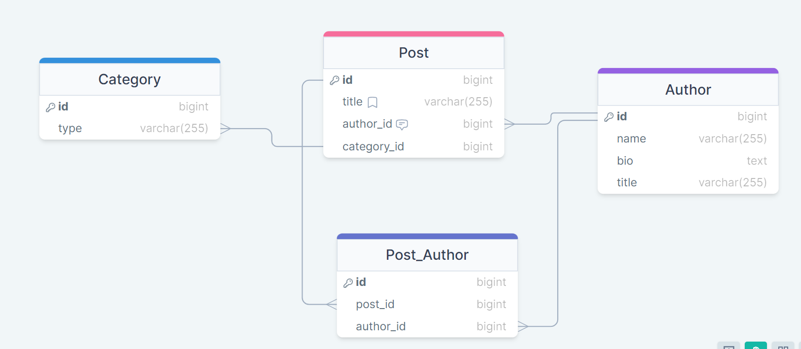

# Design Concepts

---

## Required Values

```html
<form>
    <input type="text" />
    <button type="submit">Submit</button>
</form>
```

Author

|  PK   |          name           |
| :---: | :---------------------: |
|   1   |      Rony Kordahi       |
|   2   | `<!-- Missing Data -->` |
---

## Default Values

```js
const demo = (number = 0) => {
    return number + 10;
}

const result = demo();
```

Produce: 

|  Column   | DEFAULT |
| :-------: | :-----: |
| `on_sale` | `false` |

---

## Soft Delete / Safe Delete

### Method 1: Set some flags

|  Column   |  Value  |
| :-------: | :-----: |
| `active`  | `false` |

Alternative:

|  Column   |  Value  |
| :-------: | :-----: |
| `deleted` | `true`  |

❗ If the flags are set, the row is not queried from the table

--- 

<style scoped>
    section {
        font-size: 24px;
    }
    .flex {
        display: flex;
        justify-content: space-around;
    }
</style>

## Soft Delete / Safe Delete

### Method 2: Copy and delete


<div class="flex">
<div>
Author

|  PK   |  name  |
| :---: | :----: |
|   2   | JakeWL |
</div>

<div>
Deleted_Authors

|  PK   | author_id | author_name  |
| :---: | :-------: | :----------: |
|   1   |     1     | Rony Kordahi |
</div>
</div>

❗ Only remove `Author 1` from the `Authors` table after it's been copied into the `Deleted_Authors` table.

---

## ERD: Entity Relationship Diagram



https://drawsql.app/teams/ronys-team/diagrams/demo